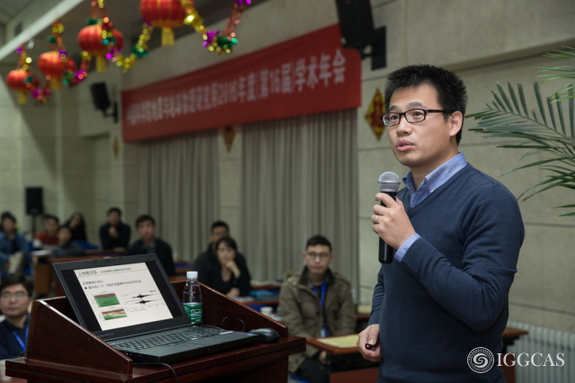

.. Weijia's website documentation master file, created by
   sphinx-quickstart on Fri Aug 11 21:17:40 2017.
   You can adapt this file completely to your liking, but it should at least
   contain the root `toctree` directive.

Dr. Weijia SUN
==============

My homepage is under constructions. Contents to be revised.

----

Associate Professor of Geophysics
---------------------------------

`Key Laboratory of Earth and Planetary Physics <http://www.epp.ac.cn/>`_

`Institute of Geology and Geophysics <http://www.igg.cas.cn/>`_

`Chinese Academy of Sciences <http://www.cas.cn/>`_

19 Beitucheng Xilu, Beijing 100029, CHINA

Tel: +86 10 8299 8363

Email: swj (at) mail.iggcas.ac.cn

----

**Research Interests**
---------------------

1. Uppermost mantle P and S velocity structures
~~~~~~~~~~~~~~~~~~~~~~~~~~~~~~~~~~~~~~~~~~~~~~~
	3--D seismic Tomography.
	
2. Mid--lithosphere discontinuity
~~~~~~~~~~~~~~~~~~~~~~~~~~~~~~~~~
	Seismic Daylight Imaging
	
3. Reflection Seismology
~~~~~~~~~~~~~~~~~~~~~~~~
	

----

.. toctree::
   :maxdepth: 1
   :caption: Table of Contents

   Publications
   Downloads

